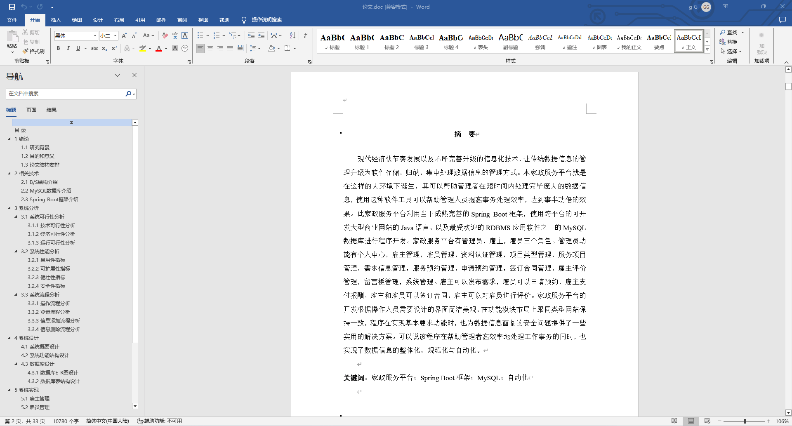
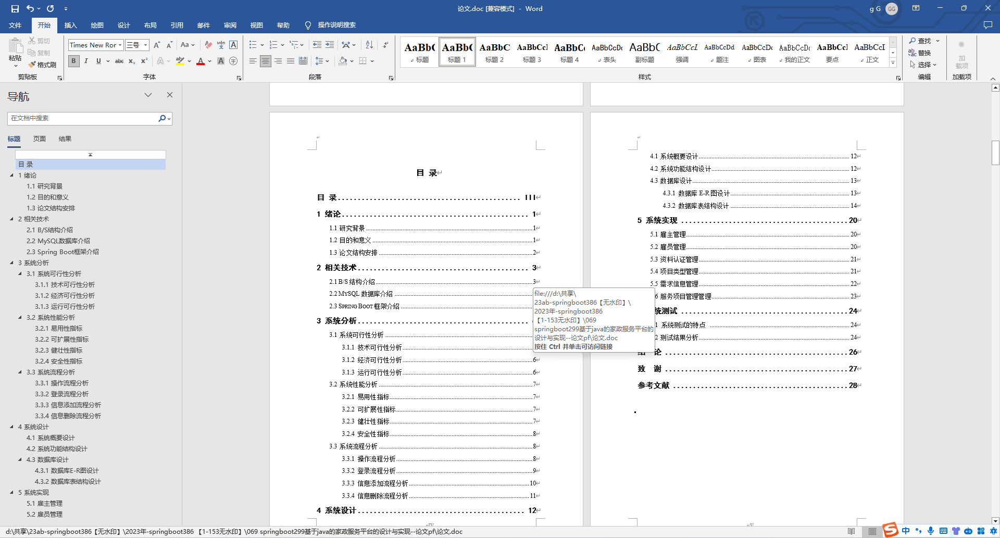
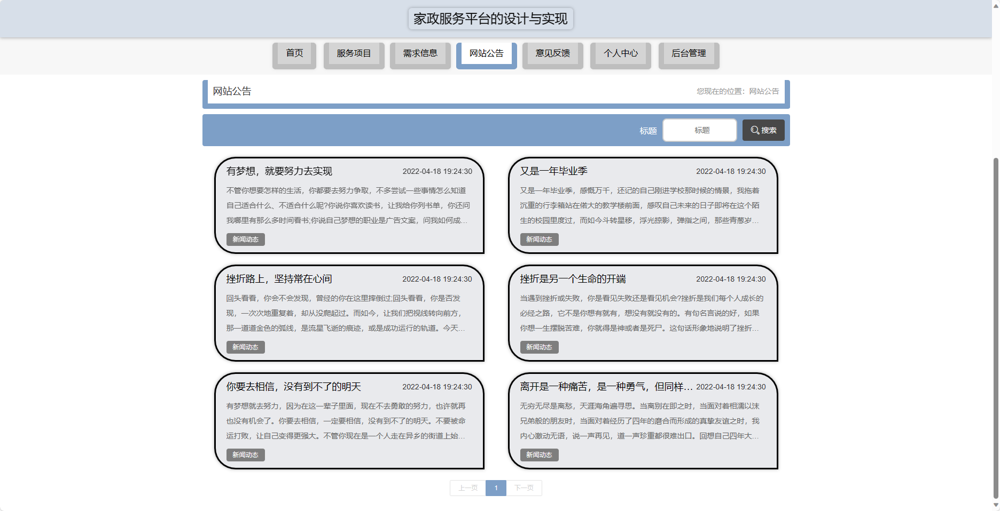
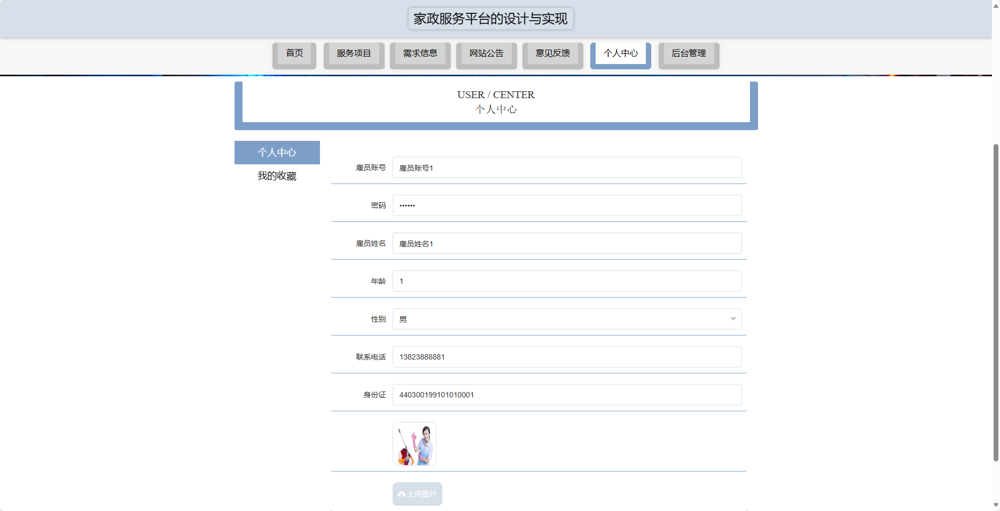
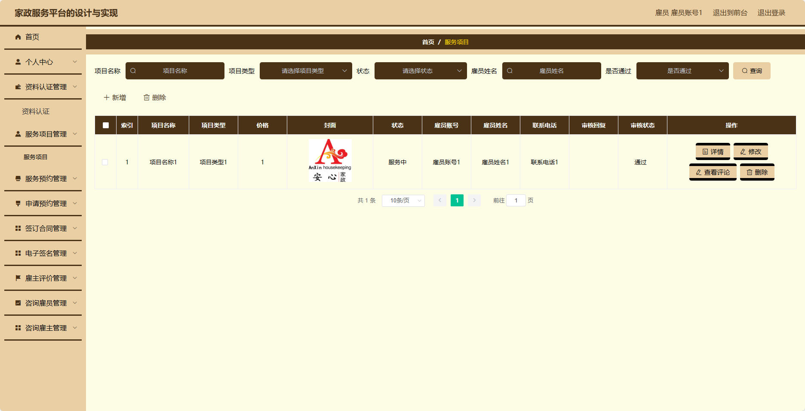
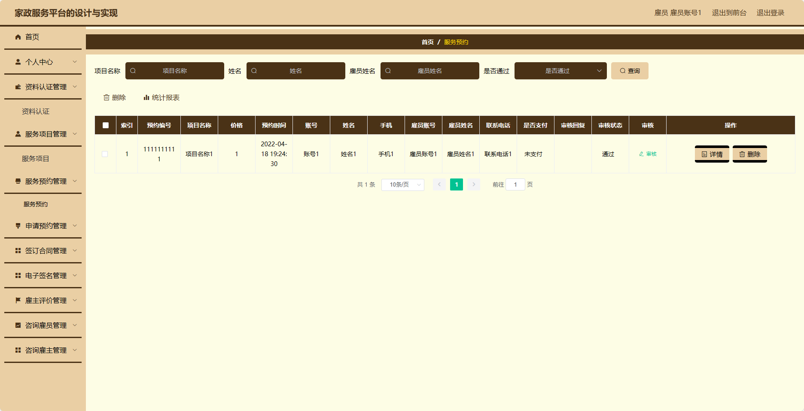
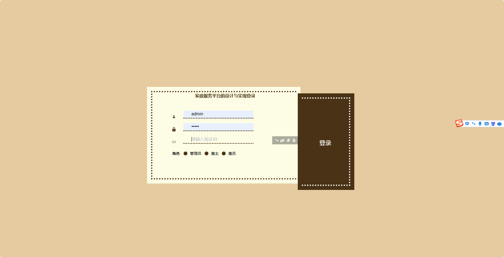

基于SpringBoot的家政服务平台（程序+论文）
=
- 完整代码获取地址：从戎源码网 ([https://armycodes.com/](https://armycodes.com/))
- 作者微信：19941326836  QQ：952045282 
- 承接计算机毕业设计、Java毕业设计、Python毕业设计、深度学习、机器学习
- 选题+开题报告+任务书+程序定制+安装调试+论文+答辩ppt 一条龙服务
- 所有选题地址https://github.com/nature924/allProject

一、项目介绍
---
基于Spring Boot框架实现的家政服务平台，系统包含两种角色：管理员、用户,系统分为前台和后台两大模块，主要功能如下。
### 前台：

首页：展示家政服务平台的相关内容。
服务项目：浏览和搜索可提供的服务项目信息。
需求信息：用户可以发布自己的需求信息。
网站公告：展示家政服务平台的公告信息。
意见反馈：用户可以向家政服务平台反馈意见和建议。
个人中心：管理个人信息，包括订单记录、个人设置等。

### 后台：

### 用户：
个人中心：管理个人信息。
资料认证管理：管理用户的身份认证信息，包括审核、驳回等操作。
服务项目管理：管理家政服务项目，包括添加、编辑、删除服务项目等操作。
服务预约管理：管理用户提交的服务预约信息，包括查看、处理、取消预约等操作。
申请预约管理：管理雇员提交的预约申请信息，包括查看、处理、驳回等操作。
签订合同管理：管理用户和雇员之间的合同签订及相关信息，包括查看、生成、下载合同等操作。
电子签名管理：管理用户和雇员之间的电子签名信息，包括查看、上传、下载等
操作。
雇主评价管理：管理雇员的评价信息，包括查看、回复、删除评价等操作。
咨询雇员管理：管理用户和雇员之间的咨询信息，包括查看、回复、删除等操作。
咨询雇主管理：管理雇员和雇主之间的咨询信息，包括查看、回复、删除等操作。

### 管理员：

个人中心：管理个人信息。
雇主管理：管理雇主账号信息，包括添加、编辑、删除雇主等操作。
雇员管理：管理雇员账号信息，包括添加、编辑、删除雇员等操作。
资料认证管理：管理用户和雇员的身份认证信息，包括审核、驳回等操作。
项目类型管理：管理家政服务项目类型，包括添加、编辑、删除服务项目类型等操作。
服务项目管理：管理家政服务项目，包括添加、编辑、删除服务项目等操作。
需求信息管理：管理用户提交的需求信息，包括查看、处理、删除等操作。
服务预约管理：管理用户提交的服务预约信息，包括查看、处理、取消预约等操作。
申请预约管理：管理雇员提交的预约申请信息，包括查看、处理、驳回等操作。
签订合同管理：管理用户和雇员之间的合同签订及相关信息，包括查看、生成、下载合同等操作。
电子签名管理：管理用户和雇员之间的电子签名信息，包括查看、上传、下载等操作。
雇主评价管理：管理雇员的评价信息，包括查看、回复、删除评价等操作。
意见反馈：管理用户提交的意见反馈，包括查看、回复、删除等操作。
系统管理：管理整个系统的相关信息，包括修改系统设置、备份数据库等操作。

### 雇主：

个人中心：管理个人信息。
需求信息管理：发布自己的需求信息，包括添加、编辑、删除需求信息等操作。
服务预约管理：管理自己提交的服务预约信息，包括查看、处理、取消预约等操作。
申请预约管理：管理雇员提交的预约申请信息，包括查看、处理、驳回等操作。
签订合同管理：管理自己和雇员之间的合同签订及相关信息，包括查看、生成、下载合同等操作。
电子签名管理：管理自己和雇员之间的电子签名信息，包括查看、上传、下载等操作。
雇主评价管理：管理雇员的评价信息，包括查看、回复、删除评价等操作。
咨询雇员管理：管理自己和雇员之间的咨询信息，包括查看、回复、删除等操作。

二、项目技术
---
- 编程语言：Java
- 数据库：MySQL
- 项目管理工具：Maven
- 前端技术：VUE、HTML、Jquery、Bootstrap
- 后端技术：Spring、SpringMVC、MyBatis

三、运行环境
---
- 操作系统：Windows、macOS都可以
- JDK版本：JDK1.8以上都可以
- 开发工具：IDEA、Ecplise、Myecplise都可以
- 数据库: MySQL5.7以上都可以
- Tomcat：任意版本都可以
- Maven：任意版本都可以

四、运行截图
---
### 论文截图：

### 程序截图：

